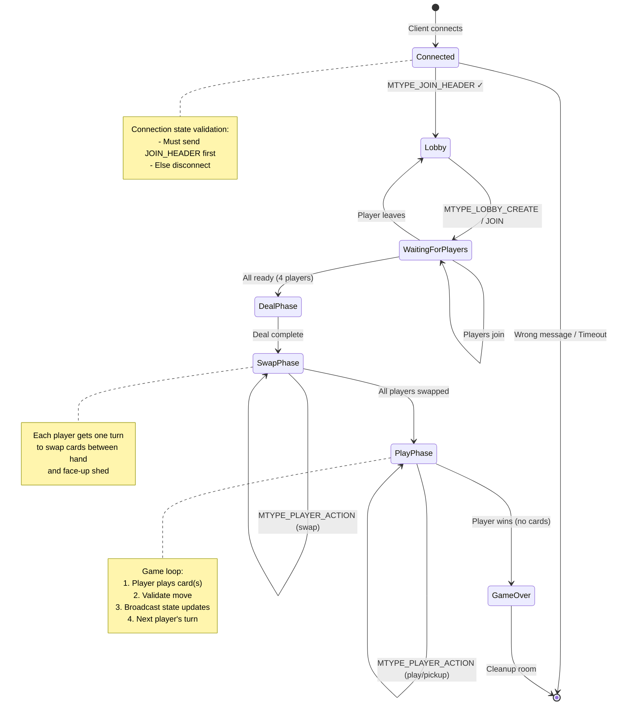
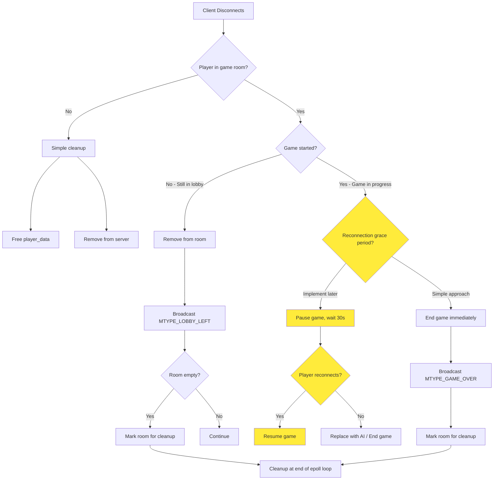

```mermaid
sequenceDiagram
    participant C1 as Client 1
    participant C2 as Client 2
    participant C3 as Client 3
    participant C4 as Client 4
    participant S as Server
    participant R as Game Room

    %% Connection Phase
    Note over C1,S: CONNECTION PHASE
    C1->>S: Connect (TCP)
    S->>C1: Connection established
    C1->>S: MTYPE_JOIN_HEADER (player name)
    S->>C1: Welcome / Connection confirmed
    
    C2->>S: Connect + MTYPE_JOIN_HEADER
    C3->>S: Connect + MTYPE_JOIN_HEADER
    C4->>S: Connect + MTYPE_JOIN_HEADER
    
    %% Lobby Phase
    Note over C1,S: LOBBY PHASE
    C1->>S: MTYPE_LOBBY_CREATE
    S->>R: Create new game room
    S->>C1: MTYPE_LOBBY_UPDATE (room created, you are player 0)
    
    C2->>S: MTYPE_LOBBY_JOIN (room_id)
    S->>R: Add player
    S->>C1: MTYPE_LOBBY_UPDATE (player 1 joined)
    S->>C2: MTYPE_LOBBY_UPDATE (you are player 1)
    
    C3->>S: MTYPE_LOBBY_JOIN (room_id)
    S->>R: Add player
    S-->>C1: MTYPE_LOBBY_UPDATE (player 2 joined)
    S-->>C2: MTYPE_LOBBY_UPDATE (player 2 joined)
    S->>C3: MTYPE_LOBBY_UPDATE (you are player 2)
    
    C4->>S: MTYPE_LOBBY_JOIN (room_id)
    S->>R: Add player
    S-->>C1: MTYPE_LOBBY_UPDATE (player 3 joined)
    S-->>C2: MTYPE_LOBBY_UPDATE (player 3 joined)
    S-->>C3: MTYPE_LOBBY_UPDATE (player 3 joined)
    S->>C4: MTYPE_LOBBY_UPDATE (you are player 3)
    
    Note over C1,C4: All players ready up
    C1->>S: MTYPE_GAME_START (ready)
    C2->>S: MTYPE_GAME_START (ready)
    C3->>S: MTYPE_GAME_START (ready)
    C4->>S: MTYPE_GAME_START (ready)
    
    %% Deal Phase
    Note over S,R: DEAL PHASE (e_phase = PHASE_DEAL_CARDS)
    S->>R: Initialize deck, shuffle
    R->>R: Deal 3 face-down shed to each player
    R->>R: Deal 3 face-up shed to each player
    R->>R: Deal 3 hand cards to each player
    
    Note over S: Broadcast game state to all players
    S-->>C1: MTYPE_HAND_INFO (all players' card counts)
    S-->>C2: MTYPE_HAND_INFO (all players' card counts)
    S-->>C3: MTYPE_HAND_INFO (all players' card counts)
    S-->>C4: MTYPE_HAND_INFO (all players' card counts)
    
    S->>C1: MTYPE_PLAYER_HAND (your 3 cards + face-up shed)
    S->>C2: MTYPE_PLAYER_HAND (your 3 cards + face-up shed)
    S->>C3: MTYPE_PLAYER_HAND (your 3 cards + face-up shed)
    S->>C4: MTYPE_PLAYER_HAND (your 3 cards + face-up shed)
    
    S-->>C1: MTYPE_DECK_STATE (phase=SWAP, turn=player 0)
    S-->>C2: MTYPE_DECK_STATE (phase=SWAP, turn=player 0)
    S-->>C3: MTYPE_DECK_STATE (phase=SWAP, turn=player 0)
    S-->>C4: MTYPE_DECK_STATE (phase=SWAP, turn=player 0)
    
    %% Swap Phase
    Note over S,R: SWAP PHASE (e_phase = PHASE_SWAP)
    Note over C1: Player 0's turn to swap
    C1->>S: MTYPE_PLAYER_ACTION (swap hand[1] ↔ shed_face_up[2])
    S->>R: Validate & apply swap
    R->>R: Update player 0 hand/shed
    
    S-->>C1: MTYPE_HAND_INFO (updated counts)
    S-->>C2: MTYPE_HAND_INFO (updated counts)
    S-->>C3: MTYPE_HAND_INFO (updated counts)
    S-->>C4: MTYPE_HAND_INFO (updated counts)
    
    S->>C1: MTYPE_PLAYER_HAND (your updated hand)
    
    S-->>C1: MTYPE_DECK_STATE (phase=SWAP, turn=player 1)
    S-->>C2: MTYPE_DECK_STATE (phase=SWAP, turn=player 1)
    S-->>C3: MTYPE_DECK_STATE (phase=SWAP, turn=player 1)
    S-->>C4: MTYPE_DECK_STATE (phase=SWAP, turn=player 1)
    
    Note over C2: Player 1's turn to swap
    C2->>S: MTYPE_PLAYER_ACTION (no swap / default)
    S->>R: Player 1 passes swap
    
    S-->>C1: MTYPE_DECK_STATE (phase=SWAP, turn=player 2)
    S-->>C2: MTYPE_DECK_STATE (phase=SWAP, turn=player 2)
    S-->>C3: MTYPE_DECK_STATE (phase=SWAP, turn=player 2)
    S-->>C4: MTYPE_DECK_STATE (phase=SWAP, turn=player 2)
    
    Note over C3,C4: Players 2 & 3 complete swaps...
    C3->>S: MTYPE_PLAYER_ACTION (swap)
    C4->>S: MTYPE_PLAYER_ACTION (swap)
    
    %% Play Phase
    Note over S,R: PLAY PHASE (e_phase = PHASE_PLAY_CARDS)
    S-->>C1: MTYPE_DECK_STATE (phase=PLAY, turn=player 0)
    S-->>C2: MTYPE_DECK_STATE (phase=PLAY, turn=player 0)
    S-->>C3: MTYPE_DECK_STATE (phase=PLAY, turn=player 0)
    S-->>C4: MTYPE_DECK_STATE (phase=PLAY, turn=player 0)
    
    Note over C1: Player 0 plays a card
    C1->>S: MTYPE_PLAYER_ACTION (play card: 7♠)
    S->>R: Validate card play
    R->>R: Apply card to pile
    R->>R: Draw replacement card from deck
    R->>R: Advance turn to next player
    
    S-->>C1: MTYPE_HAND_INFO (all players' updated counts)
    S-->>C2: MTYPE_HAND_INFO (all players' updated counts)
    S-->>C3: MTYPE_HAND_INFO (all players' updated counts)
    S-->>C4: MTYPE_HAND_INFO (all players' updated counts)
    
    S->>C1: MTYPE_PLAYER_HAND (your updated hand)
    
    S-->>C1: MTYPE_DECK_STATE (pile + phase=PLAY, turn=player 1)
    S-->>C2: MTYPE_DECK_STATE (pile + phase=PLAY, turn=player 1)
    S-->>C3: MTYPE_DECK_STATE (pile + phase=PLAY, turn=player 1)
    S-->>C4: MTYPE_DECK_STATE (pile + phase=PLAY, turn=player 1)
    
    Note over C2: Player 1's turn...
    C2->>S: MTYPE_PLAYER_ACTION (play multiple: 7♣, 7♦)
    S->>R: Validate & apply
    
    Note over S: Continue play loop...
    
    Note over C3: Invalid move example
    C3->>S: MTYPE_PLAYER_ACTION (play 3♥ on pile of 8)
    S->>R: Validation fails
    S->>C3: MTYPE_WRONG (invalid play, try again)
    
    Note over C3: Player 3 picks up pile
    C3->>S: MTYPE_PLAYER_ACTION (pick up pile)
    S->>R: Move pile to player hand
    
    S-->>C1: MTYPE_HAND_INFO (player 3 picked up X cards)
    S-->>C2: MTYPE_HAND_INFO
    S-->>C3: MTYPE_HAND_INFO
    S-->>C4: MTYPE_HAND_INFO
    
    S->>C3: MTYPE_PLAYER_HAND (your massive hand)
    
    S-->>C1: MTYPE_DECK_STATE (empty pile, turn=player 4)
    S-->>C2: MTYPE_DECK_STATE
    S-->>C3: MTYPE_DECK_STATE
    S-->>C4: MTYPE_DECK_STATE
    
    %% Game End
    Note over C1: Player 1 plays last card
    C1->>S: MTYPE_PLAYER_ACTION (play last card)
    S->>R: Player 1 has no cards left
    R->>R: Game over, player 1 wins
    
    Note over S,R: GAME OVER PHASE (e_phase = PHASE_GAME_OVER)
    S-->>C1: MTYPE_GAME_OVER (winner: player 1)
    S-->>C2: MTYPE_GAME_OVER (winner: player 1)
    S-->>C3: MTYPE_GAME_OVER (winner: player 1)
    S-->>C4: MTYPE_GAME_OVER (winner: player 1)
    
    Note over S,R: Room marked for cleanup
```

---

## State Machine Diagram



---

## Disconnect Handling Flow



---

## Server Architecture Overview

```mermaid
graph TB
    subgraph "Main Server (s_game_server)"
        A[struct s_server base_server]
        B[HashMap: active_rooms]
        C[List: waiting_lobby]
        D[List: rooms_to_cleanup]
    end
    
    A -->|owns| E[connection_lookup]
    E -->|manages| F1[s_connection 1]
    E -->|manages| F2[s_connection 2]
    E -->|manages| F3[s_connection 3]
    E -->|manages| F4[s_connection 4]
    
    F1 -->|user_data| P1[s_player_data 1]
    F2 -->|user_data| P2[s_player_data 2]
    F3 -->|user_data| P3[s_player_data 3]
    F4 -->|user_data| P4[s_player_data 4]
    
    B -->|tracks| R1[s_game_room 1]
    B -->|tracks| R2[s_game_room 2]
    
    R1 -->|players[0]| F1
    R1 -->|players[1]| F2
    R1 -->|players[2]| F3
    R1 -->|players[3]| F4
    
    P1 -.session.-> R1
    P2 -.session.-> R1
    P3 -.session.-> R1
    P4 -.session.-> R1
    
    style A fill:#e1f5ff
    style E fill:#fff9c4
    style R1 fill:#f8bbd0
    style P1 fill:#c8e6c9
```
